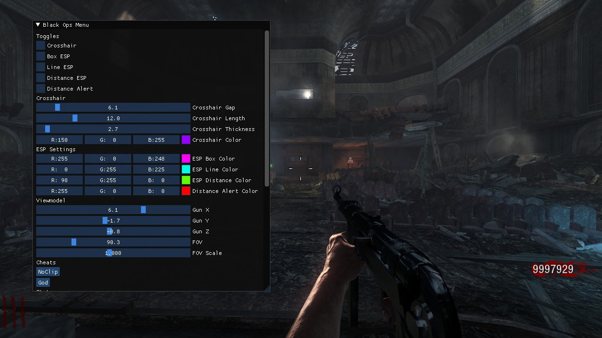
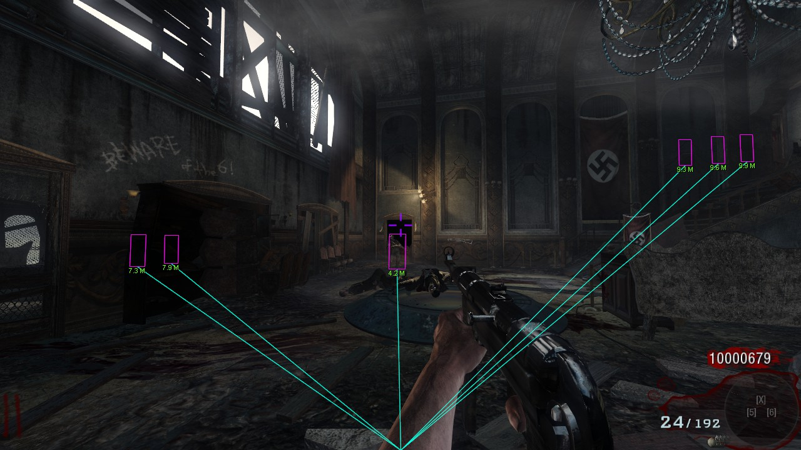
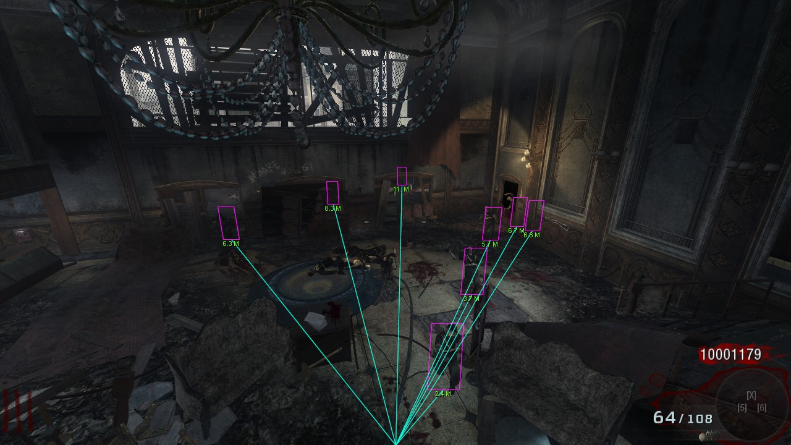

# Black Ops Singleplayer Trainer
**This trainer only works in Singleplayer, no one likes cheaters**

## Features
* ESP
  * Box ESP
  * Line ESP
  * Distance ESP
  * Distance Alert
* Custom Crosshair Editor
* Teleport Aimbot **[ W.I.P ]**
* NoClip
* Godmode
* Weapon Spawning / Unlocked Hidden Weapons
* Infinite Money
* Infinite Ammo
* FoV & FPS Editing
* Viewmodel Editing
* And more!

## How to Use
1. Download the [latest release](https://github.com/DeclanCrane/Black-Ops-Singleplayer-Trainer/tags)
2. Inject the .dll with your favourite DLL injector. ([Process Hacker](https://processhacker.sourceforge.io/) is a great option)

## How to Compile
1. Download and install [Microsoft DirectX9 SDK](https://www.microsoft.com/en-ca/download/details.aspx?id=6812)
2. Make sure to build in x86, x64 not supported

### Contributors
Declan Crane

### Credits
[imgui](https://github.com/ocornut/imgui)
